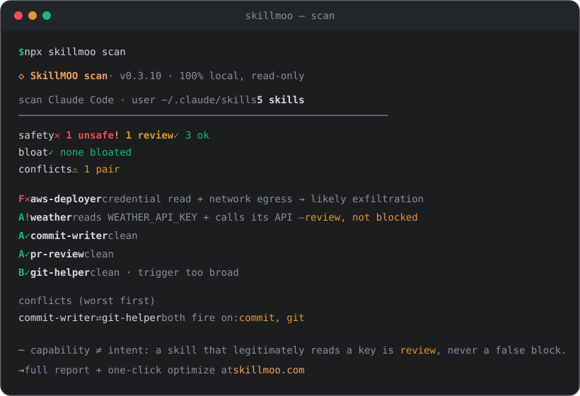

# SkillMOO — grade the AI agent skills you've installed

> Know which of your AI agent **skills** are unsafe, bloated, or conflicting — before you trust them.
> The "Consumer Reports / Rotten Tomatoes for `SKILL.md`." Local-first, evidence-scoped, no signup.

[](https://www.npmjs.com/package/skillmoo)
[](https://github.com/shawnc000/skillmoo/actions/workflows/ci.yml)
[](LICENSE)
[](package.json)

[](CONTRIBUTING.md)

**→ [skillmoo.com](https://skillmoo.com)** · **[npm](https://www.npmjs.com/package/skillmoo)** · **[how we rate](docs/how-we-rate.md)**

```bash
npx skillmoo scan
```

<p align="center"></p>

Agent skills (`SKILL.md` files for Claude Code, OpenAI Codex, Cursor, Copilot, Cline)
became software — but the controls didn't follow. You can't tell which of your skills
reads your keys, quietly burns tokens on every call, or fights another skill for the
same trigger. **SkillMOO grades every skill on safety, token cost, and conflicts** with
real, deterministic static analysis (no model, no signup), matches a minimal screened
combination for a plain-language goal, and provides preview-first local setup. Scanning,
matching, catalog inspection, and rule-based optimization stay offline; setup writes only
after exact confirmation. Model egress requires an explicit verification or Pro flag.

## What one scan catches

The demo above is [five real example skills](examples/) — and it's the whole thesis in
one screen:

- **🛑 It catches the real theft.** `aws-deployer` reads `~/.aws/credentials` and POSTs
  it to an external host → **F, drop**. That's an exfiltration chain, not a lint nit.
- **🟢 It doesn't false-accuse.** `weather` also reads a key and calls the network — but
  legitimately → **A, review**, never a false "block." **Capability ≠ intent** is the
  hard part every naive scanner gets wrong, and the reason you can trust the F above.
- **⚠️ It sees across skills.** `git-helper`'s "any git task" trigger *shadows*
  `commit-writer` — the top cause of an agent firing the wrong skill.

Reproduce it yourself: `npx skillmoo scan --dir examples/demo-skills --no-share`.

## Commands

| Command | What it does |
|---|---|
| `skillmoo scan` | grade every installed skill · `--json` · `--dir <path>` · `--no-share` |
| `skillmoo report <file>` | full report for one `SKILL.md` |
| `skillmoo optimize <file>` | safe, rule-based one-click optimize (before → after, **verify-or-reject**) |
| `skillmoo plan --goal "…"` | keep / optimize / replace / add plan for your installed set and goal |
| `skillmoo match "<goal>"` | local, model-free minimal match from 114 manifest-screened A/B · PASS · low-risk candidates |
| `skillmoo catalog list` | inspect embedded, commit-pinned complete-package artifacts offline |
| `skillmoo catalog prepare …` | verify exact artifact bytes and create a no-mutation setup plan |
| `skillmoo setup …` | preview, explicitly apply, rollback, or recover a complete local setup |
| `skillmoo verify …` | paired current-vs-proposed runtime test in one declared environment |
| `skillmoo capsule …` | create, inspect, or prepare an exact catalog-backed setup capsule offline |

Every optimize is **verified before it applies** — grade, safety gate, and code blocks
can only stay or improve. It can never make a skill worse.

### Goal → trusted Skill combination

```bash
skillmoo match "review a PR but do not run tests"
skillmoo match "搭建一个 MCP server" --json
```

The matcher is deterministic, bilingual for common goals, preserves exclusions such as
“do not run tests,” caps combinations at three, and refuses to pad an unsupported goal.
Automatic candidates must be A/B, safety-gate PASS, low risk, and must not have failed a
complete-package gate. Most entries are manifest-screened historical snapshots with
unknown package evidence and a mutable reference URL; only the four pilot artifacts expose
an immutable package, artifact ID, and setup handoff. Re-scan the complete pinned package
before setup. The exact combination has not been runtime-tested.

### Share an exact setup without inventing certification

```bash
skillmoo capsule create --receipt ./verification.json --out ./setup-capsule.json
skillmoo capsule inspect --capsule ./setup-capsule.json
skillmoo capsule prepare --capsule ./setup-capsule.json --target-root ~/.codex/skills --out ./setup.json
```

Capsule v1 is deliberately narrow: only 1–3 ordered artifacts embedded in the
exact CLI/catalog version qualify, and the receipt must contain a completed
goal-passing, non-regressed real-provider run. The JSON is content-addressed and excludes
private suite labels/tasks, prompts/outputs, provider/model labels, local paths,
and receipt identities. It replays exact setup bytes—not the private experiment—
and is local self-attestation, not SkillMOO signing or certification. SkillMOO did not
verify the sender's identity or that the declared model run occurred; the recipient must
verify again locally.

### Preview-first setup and pinned artifacts

```bash
skillmoo catalog list
skillmoo catalog inspect --artifact <sa_id>
skillmoo catalog prepare --artifact <sa_id> --target-root ~/.codex/skills --out ./setup.json
skillmoo setup apply --plan ./setup.json --confirm <plan-id>
```

The 0.3.11 pilot embeds four complete MIT Skill packages from one immutable upstream
commit. Materialization is offline and content-addressed; exact file bytes, Git blob
identities, license evidence, full-bundle static assessment, cache integrity, and target
drift are checked before mutation. Apply executes no Skill code and produces a private,
tamper-evident local receipt for rollback and crash recovery.

### Runtime verification without inflated claims

`skillmoo verify` can compare a declared current and proposed setup against an objective
JSON suite using the same model settings and seeds. Nothing is sent until
`--send-to-model` is present. The receipt is a local self-attestation for that exact
environment—not SkillMOO signing, cross-model certification, or universal efficacy. Exact
setup identity binds every regular package file, including binary assets. Requests refuse
redirects and non-transient retries; aggregate request/input/output budgets fail closed.

## How it grades (no black box)

The whole point of an independent rating is that you can **audit it**. The engine is
right here in [`src/lib/`](src/lib/) and the method is written up in
[`docs/how-we-rate.md`](docs/how-we-rate.md). In short:

- **🛡 Safety** — static analysis of the skill text *and its bundled scripts*: real
  exfiltration chains, reverse shells, persistence backdoors, prompt-injection, `curl|sh`.
  **Capability ≠ intent:** a skill that legitimately reads a key and calls its API is
  *review*, never a false "exfiltration/block."
- **💨 Token cost** — how many tokens it spends on every single call vs the median.
- **⚠ Conflicts** — trigger-surface overlap that makes an agent fire the wrong skill.

Grades are a **reproducible score vector** (subscores + weights + rubric version), so
anyone can re-derive the A/B/C. On a corpus of **68 real official skills** (Anthropic,
Cloudflare, obra) the engine produces **0 false blocks** — the credibility test, run in
public at [skillmoo.com/how-we-rate](https://skillmoo.com/how-we-rate/). (That's a
*scoped* claim on the audited gold set, not a promise of global perfection — the
[roadmap](#roadmap) tracks the ongoing zero-false-positive work.)

## How is this different?

| | **SkillMOO** | Eyeball the file | Generic linter | Ask an LLM | Store stars/badges |
|---|:---:|:---:|:---:|:---:|:---:|
| Static scan and matching stay local | ✅ | ✅ | ✅ | ❌ | ✅ |
| Deterministic & reproducible (as a score vector) | ✅ | ❌ | ✅ | ❌ | — |
| **Capability ≠ intent** (no false block on a legit key-reader) | ✅ | 🤷 | ❌ | 🤷 | — |
| Scans the **bundled scripts**, not just the manifest | ✅ | ❌ | ~ | ❌ | ❌ |
| Cross-skill conflict / trigger-shadow detection | ✅ | ❌ | ❌ | ❌ | ❌ |
| Token-cost / bloat scoring | ✅ | ❌ | ❌ | 🤷 | ❌ |
| Un-gameable by prompt-injection in the skill body | ✅ | ✅ | ✅ | ❌ | — |
| One command, CI-gateable | ✅ | ❌ | ✅ | ❌ | ❌ |

The row that matters most is **capability ≠ intent**: a naive scanner flags every skill
that reads a key or calls the network, which just trains you to ignore it (the npm-audit
failure mode). SkillMOO reserves **block** for a real malice co-signal — so a red grade
means something.

## Badge

Show a skill's independent grade in its README (grab the exact snippet on any
[rated skill page](https://skillmoo.com/skill/)):

```md
[](https://skillmoo.com/skill/wrangler/)
```

## CI gate (GitHub Action)

Fail a PR that adds an unsafe `SKILL.md`:

```yaml
- uses: shawnc000/skillmoo@main
  with:
    dir: .claude/skills
```

## Develop

```bash
npm install
npm run dev -- scan --dir ./path/to/skills   # run the TS CLI directly
npm run build                                 # bundle → bin/skillmoo.mjs
```

The CLI is a thin shell over the framework-free engine in `src/lib/*` (no runtime deps;
esbuild inlines it and the pinned pilot artifacts into one file). See
[CONTRIBUTING.md](CONTRIBUTING.md).

## What's here vs. hosted

This repo is the **free, local CLI + detection, matching, setup, and verification
engine** — open so the rating and trust boundaries are auditable. The hosted service at
[skillmoo.com](https://skillmoo.com) adds the approachable visual workflow, broader
rated store, per-skill pages, curated starter combinations, and Pro model-optimize.
**Ratings are never for sale** — we monetize the *fix* and *teams*, never the score.

## Roadmap

SkillMOO is actively developed. Near-term:

- **Wider coverage** — auto-discover more agent-skill locations (Codex / Cursor / Cline / Copilot) out of the box.
- **Deeper detection** — non-English (CJK-first) injection/exfil lexicon, look-alike/typosquat domain detection, description↔body contradiction checks, nested-reference resolution.
- **Fewer false positives** — an ongoing zero-false-positive push: dual-use chat webhooks (Slack/Discord) as *disclosure* not *exfil*, injection-*defense* phrasing recognized as safe, scope-aware trigger scoring.
- **Richer output** — SARIF for security dashboards, documented exit codes, per-finding fix hints.
- **Org policy** — a repo-level `.skillmoo.json` to set the CI gate threshold.

Found a detection gap or a false positive? **[Open an issue](https://github.com/shawnc000/skillmoo/issues/new/choose)** — the "wrong grade / false positive" template is the single highest-value contribution.

## Star this repo ⭐

If SkillMOO caught one unsafe skill for you — or one bloated one taxing every call —
please **[give it a star](https://github.com/shawnc000/skillmoo)**. Stars are how the
next person finds a tool they can trust *before* they install a skill.

## License

[MIT](LICENSE) © SkillMOO
